# OptEngine Mature Design — Mermaid Diagrams with LaTeX Mathematics

[Back to package index](./README.md)

All diagrams are provided as editable Mermaid source. Mathematical notation is written in LaTeX throughout. GitHub Markdown equations use MathJax delimiters (`$...$` and `$$...$$`), while Mermaid flowcharts use Mermaid's KaTeX-compatible `$$...$$` math syntax. Each substantial equation is also stated as Markdown math immediately above the relevant diagram so the mathematics remains readable when a Mermaid renderer does not support embedded math.

## 01. Domain interpretation API

One public method supports domain interpretation and candidate evaluation while preserving omission versus explicit `None`.

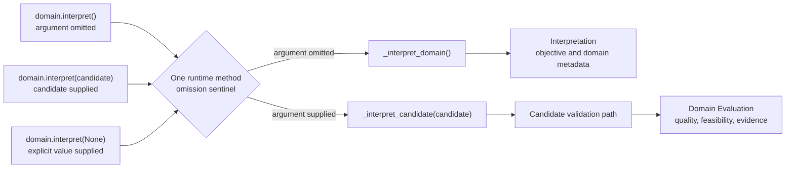

## 02. Domain aggregate construction

Input assembly constructs entities first, resolves relationships second, and then creates the aggregate with object references.

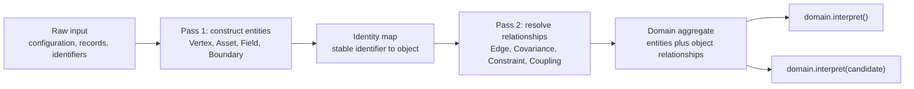

## 03. Max-Cut domain aggregate and candidate evaluation

The Max-Cut aggregate defines graph meaning, produces a binary quadratic objective, and evaluates decoded partitions.

$$
x_v \in \{0,1\} \quad \forall v \in V,
\qquad
C(x)=\sum_{(u,v)\in E} w_{uv}\left(x_u+x_v-2x_u x_v\right).
$$

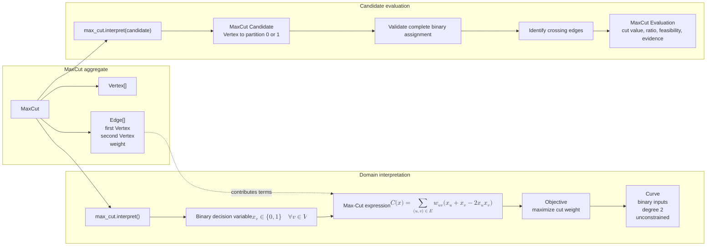

## 04. Portfolio domain aggregate and candidate evaluation

The Portfolio aggregate owns financial semantics, builds a constrained utility objective, and evaluates decoded allocations.

$$
U(w)=\mu^\top w-\lambda w^\top \Sigma w-C_{\mathrm{tx}}(w,w^{(0)})-C_{\mathrm{conc}}(w),
\qquad \mathbf{1}^\top w=1.
$$

```mermaid
flowchart LR
    subgraph AGG["Portfolio aggregate"]
        P["Portfolio"]
        A["Asset[]"]
        C["Covariance[]<br/>Asset object references"]
        G["Guardrails<br/>budget, bounds, exposure,<br/>liquidity, cardinality"]
        H["CurrentHolding[]"]
        P --> A
        P --> C
        P --> G
        P --> H
    end

    subgraph INT["Domain interpretation"]
        CALL["portfolio.interpret()"]
        VAR["Allocation variables<br/>$$w_i\in\mathbb{R}$$ or $$u_i\in\mathbb{Z}_{\ge 0}$$"]
        EX["Utility expression<br/>$$U(w)=\mu^\top w-\lambda w^\top\Sigma w-C_{\mathrm{tx}}-C_{\mathrm{conc}}$$"]
        CON["Guardrails<br/>$$\mathbf{1}^\top w=1$$<br/>bounds, exposure, liquidity, cardinality"]
        OBJ["Objective<br/>maximize expected utility"]
        CURVE["Curve<br/>real, integer, or binary inputs<br/>degree up to 2<br/>constrained"]
        CALL --> VAR --> EX --> OBJ --> CURVE
        CON --> EX
    end

    subgraph EVAL["Candidate evaluation"]
        CCALL["portfolio.interpret(candidate)"]
        CA["Portfolio Candidate<br/>allocation by Asset"]
        CHECK["Validate allocations and guardrails"]
        MET["Compute return, risk, turnover,<br/>concentration, violations"]
        EV["Portfolio Evaluation<br/>objective terms, feasibility, evidence"]
        CCALL --> CA --> CHECK --> MET --> EV
    end

    P --> CALL
    C -.->|risk terms| EX
    G -.->|constraint terms| CON
    P --> CCALL
```

## 05. Scientific-domain extension boundary

A scientific field domain follows the same aggregate and candidate-evaluation pattern while using a future operator/tensor expression profile instead of forcing polynomial semantics.

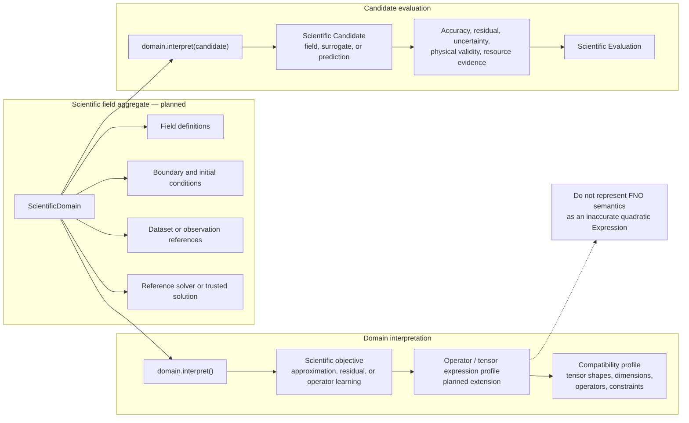

## 06. Objective, Expression, and Curve

`Curve` is derived from the actual expression structure and drives compatibility without naming a concrete domain.

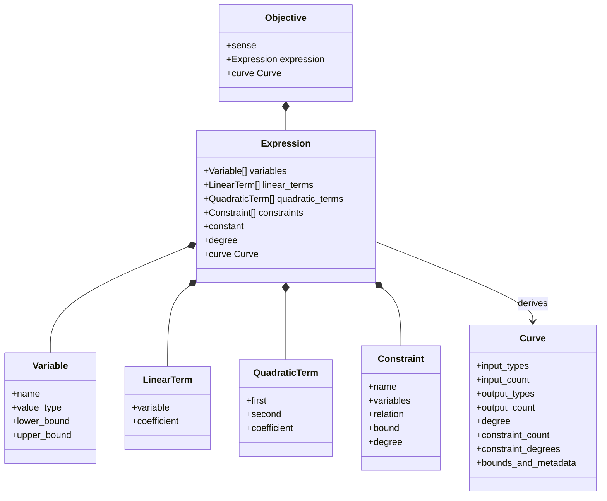

## 07. Max-Cut expression

Each graph vertex becomes a binary variable and each edge contributes linear and quadratic terms to the cut objective.

$$
x_v \in \{0,1\},
\qquad
C(x)=\sum_{(u,v)\in E} w_{uv}\left(x_u+x_v-2x_u x_v\right).
$$

```mermaid
flowchart LR
    G["Weighted graph<br/>$$G=(V,E,w)$$"]
    VAR["Variables<br/>$$x_v \in \{0,1\}$$"]
    EDGE["Per-edge contribution<br/>$$w_{uv}(x_u+x_v-2x_u x_v)$$"]
    EX["Objective expression<br/>$$C(x)=\sum_{(u,v)\in E}w_{uv}(x_u+x_v-2x_u x_v)$$"]
    OBJ["Objective<br/>maximize"]
    CURVE["Curve<br/>binary input count: $$\lvert V\rvert$$<br/>one real output<br/>quadratic<br/>no explicit constraints"]

    G --> VAR
    G --> EDGE
    VAR --> EDGE --> EX --> OBJ --> CURVE
```

## 08. Bounded discrete portfolio expression

The MVP portfolio uses bounded allocation units, optional selectors, a quadratic utility, and explicit constraints.

$$
w_i(u_i)=\Delta_i u_i,
\quad u_i\in\{0,\ldots,U_i\},
\quad z_i\in\{0,1\},
$$

$$
U(u)=\mu^\top w(u)-\lambda w(u)^\top \Sigma w(u)-C_{\mathrm{tx}}(w(u))-C_{\mathrm{conc}}(w(u)),
\qquad \sum_i w_i(u_i)=1.
$$

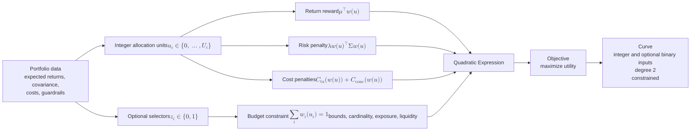

## 09. Continuous mean–variance portfolio expression

The Vanguard classical baseline uses real-valued allocations with a constrained quadratic risk/return objective.

$$
\max_w\; U(w)=\mu^\top w-\lambda w^\top \Sigma w-C_{\mathrm{tx}}(w,w^{(0)})-C_{\mathrm{conc}}(w),
\qquad \mathbf{1}^\top w=1.
$$

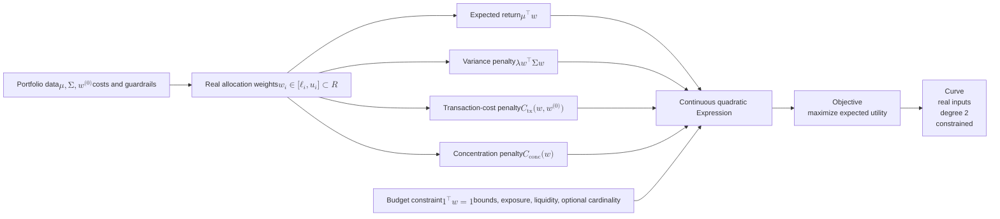

## 10. Formulation collaboration

A formulation checks the source curve, expresses a compatible objective, and returns an immutable model containing the transformed payload and decoder.

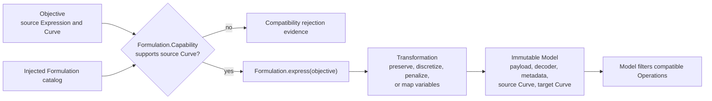

## 11. QUBO formulation family

Direct QUBO preserves an already compatible objective; penalty QUBO transforms constraints or variable types and must retain validation metadata.

$$
\min_{x\in\{0,1\}^n}\; x^\top Qx + c.
$$

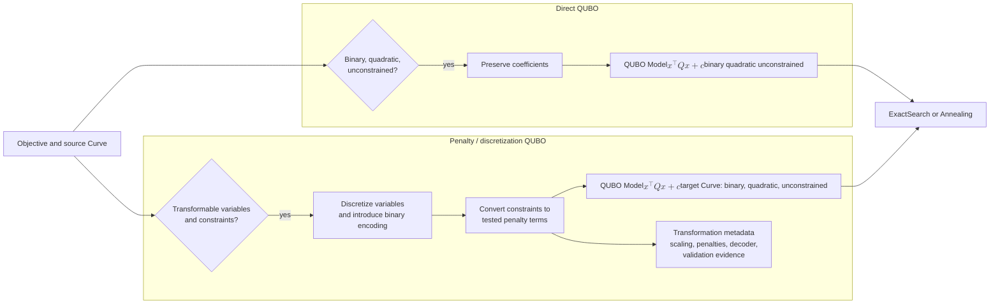

## 12. CQM / quadratic-program formulation

A constrained quadratic formulation preserves explicit constraints and supports binary, integer, or real variables where compatible.

$$
\min_x\; x^\top Qx+q^\top x+c
\quad \text{subject to} \quad Ax\le b,\; A_{\mathrm{eq}}x=b_{\mathrm{eq}}.
$$

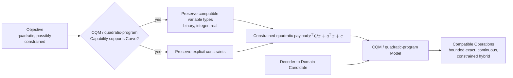

## 13. Hamiltonian / Ising formulation

The formulation maps compatible binary decision semantics into a cost Hamiltonian while preserving the decoder back to a domain candidate.

$$
x_i=\frac{1-Z_i}{2}.
$$

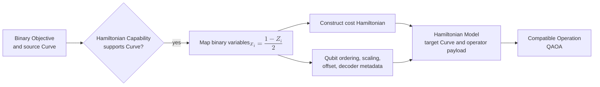

## 14. Operation collaboration

An operation checks the model it receives, filters compatible solvers, and prepares a native request without owning backend execution.

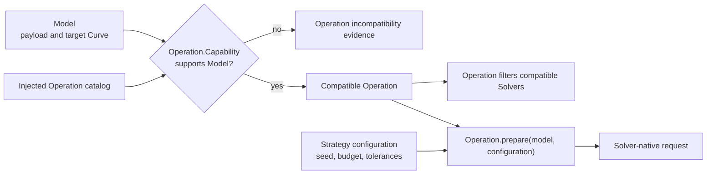

## 15. Exact-search operation

Exact search prepares finite enumeration from the model and delegates native execution to a compatible exact solver.

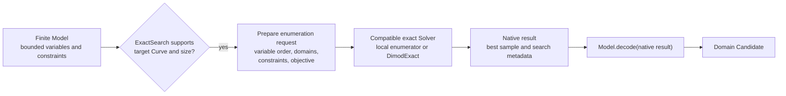

## 16. Continuous-optimization operation

Continuous optimization prepares variables, bounds, constraints, objective callbacks, and tolerances for a compatible numerical solver.

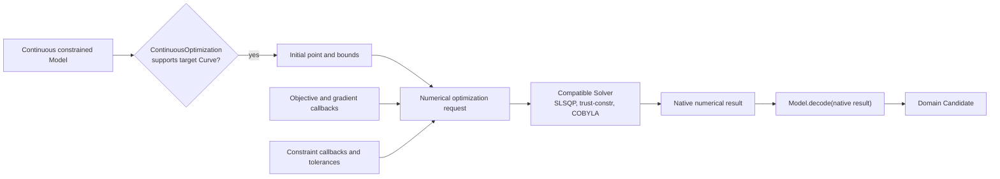

## 17. Annealing operation

Annealing prepares a binary quadratic model, sampling configuration, and seed or hardware parameters for a compatible sampler.

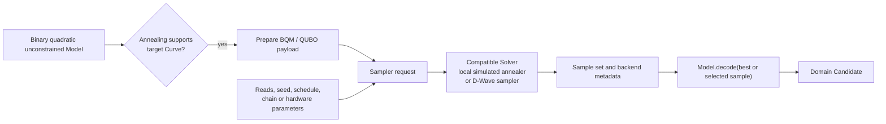

## 18. QAOA operation

QAOA prepares the cost operator, mixer, ansatz, optimizer, shots, and depth for a compatible gate-model solver.

$$
\lvert\psi(\boldsymbol{\gamma},\boldsymbol{\beta})\rangle=\prod_{\ell=1}^{p} e^{-i\beta_\ell H_M}e^{-i\gamma_\ell H_C}\lvert+\rangle^{\otimes n}.
$$

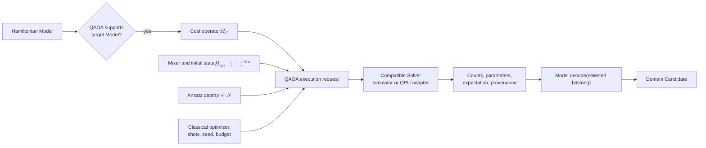

## 19. Capability-driven Strategy construction

Analysis filters injected catalogs polymorphically and records every compatible formulation–model–operation–solver collaboration as an immutable Strategy.

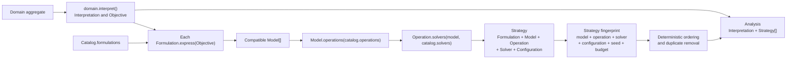

## 20. Max-Cut reference vertical slice

Max-Cut is the first complete migration path used to stabilize object collaboration, compatibility, decoding, evaluation, utility, and recommendation behavior.

$$
C(x)=\sum_{(u,v)\in E} w_{uv}\left(x_u+x_v-2x_u x_v\right).
$$

```mermaid
flowchart LR
    D["MaxCut aggregate"]
    I["Interpretation"]
    O["Binary quadratic Objective<br/>$$C(x)$$"]
    C["Curve"]
    F1["Direct QUBO"]
    F2["Hamiltonian / Ising"]
    M1["QUBO Model"]
    M2["Hamiltonian Model"]
    OP1["ExactSearch"]
    OP2["Annealing"]
    OP3["QAOA"]
    S1["Exact Solver"]
    S2["Annealing Solver"]
    S3["Gate-model Solver"]
    NR["Native result per Strategy"]
    DECODE["Strategy.model.decode(native result)"]
    CA["MaxCut Candidate"]
    INTERP["max_cut.interpret(candidate)"]
    EV["MaxCut Evaluation"]
    X["Execution record<br/>complete or failed"]
    XS["Execution[]"]
    U["UtilityModel.assess(Execution[])"]
    UT["Utility"]
    P["Policy.apply(Utility)"]
    DEC["Stop | Switch | Scale"]
    R["Recommendation"]
    W["Writer<br/>JSON and artifacts"]

    D --> I --> O --> C
    O --> F1 --> M1
    O --> F2 --> M2
    M1 --> OP1 --> S1 --> NR
    M1 --> OP2 --> S2 --> NR
    M2 --> OP3 --> S3 --> NR
    NR --> DECODE --> CA --> INTERP --> EV --> X --> XS
    S1 -.->|failure captured| X
    S2 -.->|failure captured| X
    S3 -.->|failure captured| X
    XS --> U --> UT --> P --> DEC --> R --> W
```

## 21. Portfolio / Vanguard end-to-end path

The Portfolio path establishes continuous and bounded classical references before QUBO, annealing, Hamiltonian, or QAOA evidence is compared.

$$
U(w)=\mu^\top w-\lambda w^\top\Sigma w-C_{\mathrm{tx}}(w,w^{(0)})-C_{\mathrm{conc}}(w).
$$

```mermaid
flowchart LR
    D["Portfolio aggregate"]
    I["Interpretation"]
    O["Risk–return–cost Objective<br/>$$U(w)$$ with guardrails"]
    C["Source Curve"]

    F1["CQM / quadratic program"]
    F2["Penalty QUBO"]
    F3["Hamiltonian / Ising"]

    M1["Continuous or constrained Model"]
    M2["Binary QUBO Model"]
    M3["Hamiltonian Model"]

    OP1["ContinuousOptimization"]
    OP2["Bounded ExactSearch"]
    OP3["Annealing"]
    OP4["QAOA"]

    S1["Classical numerical Solver"]
    S2["Classical exact Solver"]
    S3["Annealing Solver"]
    S4["Gate-model Solver"]

    NR["Native result per Strategy"]
    DECODE["Strategy.model.decode(native result)"]
    CA["Portfolio Candidate"]
    INTERP["portfolio.interpret(candidate)"]
    EV["Portfolio Evaluation"]
    X["Execution record<br/>quality, feasibility, runtime,<br/>resource cost, provenance"]
    XS["Execution[]"]
    U["Utility comparison"]
    P["Stop | Switch | Scale"]
    R["Recommendation<br/>evidence, explanation, artifacts"]

    D --> I --> O --> C
    O --> F1 --> M1
    O --> F2 --> M2
    O --> F3 --> M3
    M1 --> OP1 --> S1 --> NR
    M1 --> OP2 --> S2 --> NR
    M2 --> OP3 --> S3 --> NR
    M3 --> OP4 --> S4 --> NR
    NR --> DECODE --> CA --> INTERP --> EV --> X --> XS
    S1 -.->|failure captured| X
    S2 -.->|failure captured| X
    S3 -.->|failure captured| X
    S4 -.->|failure captured| X
    XS --> U --> P --> R
```

## 22. Object ownership boundaries

The diagram separates semantic meaning, mathematical representation, execution plugins, comparative evidence, control, and persistence.

```mermaid
flowchart LR
    subgraph DS["Domain semantics"]
        D["Domain aggregate"]
        I["Interpretation"]
        C["Candidate"]
        E["Domain Evaluation"]
        D --> I
        C --> D --> E
    end

    subgraph MS["Mathematical representation"]
        O["Objective"]
        X["Expression"]
        CV["Curve"]
        F["Formulation"]
        M["Model and Decoder"]
        O --> X --> CV
        O --> F --> M
    end

    subgraph ES["Execution plugins"]
        OP["Operation"]
        S["Solver"]
        NR["Native Result"]
        OP --> S --> NR
    end

    subgraph CS["Analysis, evidence, and control"]
        ST["Strategy"]
        EXE["Execution"]
        UM["UtilityModel"]
        U["Utility"]
        P["Policy Decision"]
        R["Recommendation"]
        ST --> EXE --> UM --> U --> P --> R
    end

    subgraph PS["Persistence"]
        W["Writer"]
        OUT["JSON and artifacts"]
        W --> OUT
    end

    I --> O
    M --> OP
    M --> ST
    OP --> ST
    S --> ST
    NR --> M
    M --> C
    E --> EXE
    R --> W
```

## 23. Domain–Formulation–Operation compatibility lattice

The lattice summarizes intended compatibility paths; dashed scientific paths are planned extensions rather than current polynomial implementations.

```mermaid
flowchart LR
    subgraph DOM["Domains / source objectives"]
        MC["Max-Cut<br/>binary quadratic"]
        PD["Portfolio<br/>bounded discrete"]
        PC["Portfolio<br/>continuous"]
        SD["Scientific field domain<br/>planned"]
    end

    subgraph FORM["Formulations"]
        DQ["Direct QUBO"]
        PQ["Penalty QUBO"]
        CQM["CQM / quadratic program"]
        H["Hamiltonian / Ising"]
        OM["Operator / surrogate formulation<br/>planned"]
    end

    subgraph OPS["Operations"]
        EX["ExactSearch"]
        CO["ContinuousOptimization"]
        AN["Annealing"]
        QA["QAOA"]
        SI["Surrogate train / infer<br/>planned"]
    end

    MC --> DQ
    MC --> H
    PD --> CQM
    PD --> PQ
    PD --> H
    PC --> CQM
    SD -.-> OM

    DQ --> EX
    DQ --> AN
    PQ --> EX
    PQ --> AN
    CQM --> EX
    CQM --> CO
    H --> QA
    OM -.-> SI
```

