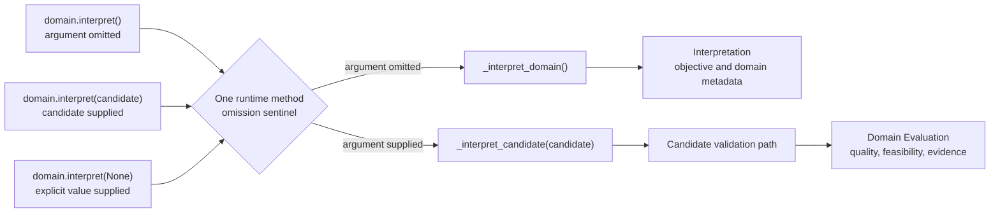

# Domain interpretation API

[Back to diagram atlas](../README.md)

## 01. Domain interpretation API

One public method supports domain interpretation and candidate evaluation while preserving omission versus explicit `None`.

