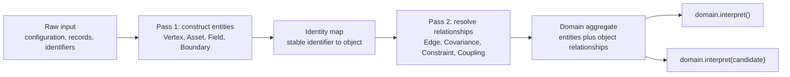

# Domain aggregate construction

[Back to diagram atlas](../README.md)

## 02. Domain aggregate construction

Input assembly constructs entities first, resolves relationships second, and then creates the aggregate with object references.

