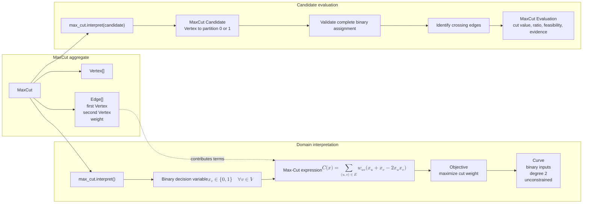

# Max-Cut domain aggregate and candidate evaluation

[Back to diagram atlas](../README.md)

## 03. Max-Cut domain aggregate and candidate evaluation

The Max-Cut aggregate defines graph meaning, produces a binary quadratic objective, and evaluates decoded partitions.

$$
x_v \in \{0,1\} \quad \forall v \in V,
\qquad
C(x)=\sum_{(u,v)\in E} w_{uv}\left(x_u+x_v-2x_u x_v\right).
$$

