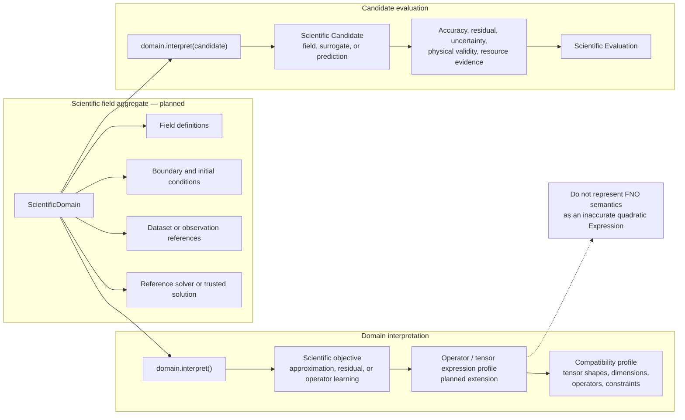

# Scientific-domain extension boundary

[Back to diagram atlas](../README.md)

## 05. Scientific-domain extension boundary

A scientific field domain follows the same aggregate and candidate-evaluation pattern while using a future operator/tensor expression profile instead of forcing polynomial semantics.

