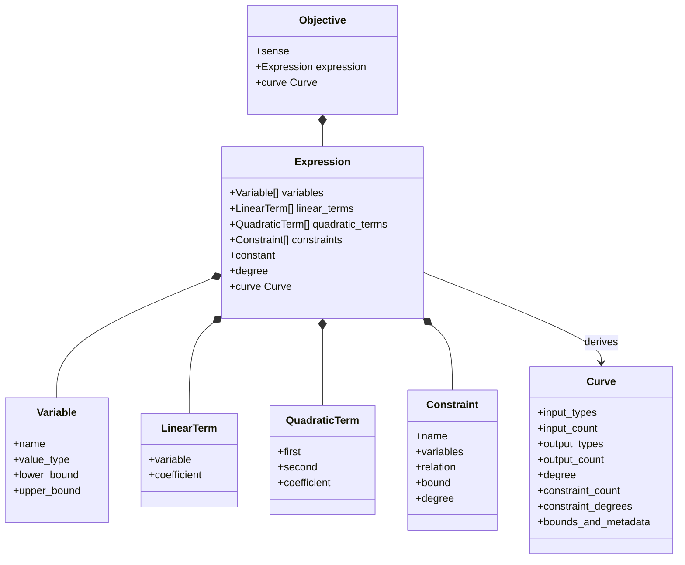

# Objective, Expression, and Curve

[Back to diagram atlas](../README.md)

## 06. Objective, Expression, and Curve

`Curve` is derived from the actual expression structure and drives compatibility without naming a concrete domain.

