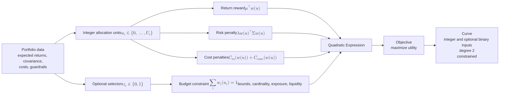

# Bounded discrete portfolio expression

[Back to diagram atlas](../README.md)

## 08. Bounded discrete portfolio expression

The MVP portfolio uses bounded allocation units, optional selectors, a quadratic utility, and explicit constraints.

$$
w_i(u_i)=\Delta_i u_i,
\quad u_i\in\{0,\ldots,U_i\},
\quad z_i\in\{0,1\},
$$

$$
U(u)=\mu^\top w(u)-\lambda w(u)^\top \Sigma w(u)-C_{\mathrm{tx}}(w(u))-C_{\mathrm{conc}}(w(u)),
\qquad \sum_i w_i(u_i)=1.
$$

