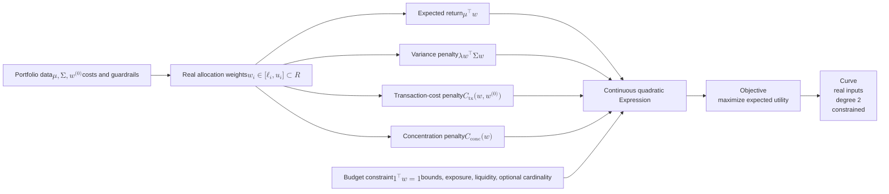

# Continuous mean–variance portfolio expression

[Back to diagram atlas](../README.md)

## 09. Continuous mean–variance portfolio expression

The Vanguard classical baseline uses real-valued allocations with a constrained quadratic risk/return objective.

$$
\max_w\; U(w)=\mu^\top w-\lambda w^\top \Sigma w-C_{\mathrm{tx}}(w,w^{(0)})-C_{\mathrm{conc}}(w),
\qquad \mathbf{1}^\top w=1.
$$

