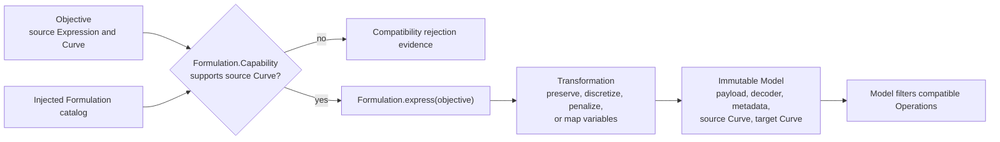

# Formulation collaboration

[Back to diagram atlas](../README.md)

## 10. Formulation collaboration

A formulation checks the source curve, expresses a compatible objective, and returns an immutable model containing the transformed payload and decoder.

