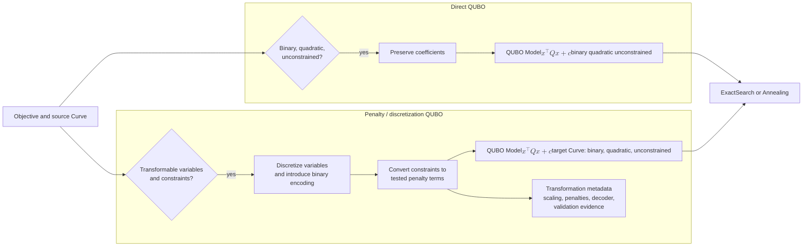

# QUBO formulation family

[Back to diagram atlas](../README.md)

## 11. QUBO formulation family

Direct QUBO preserves an already compatible objective; penalty QUBO transforms constraints or variable types and must retain validation metadata.

$$
\min_{x\in\{0,1\}^n}\; x^\top Qx + c.
$$

