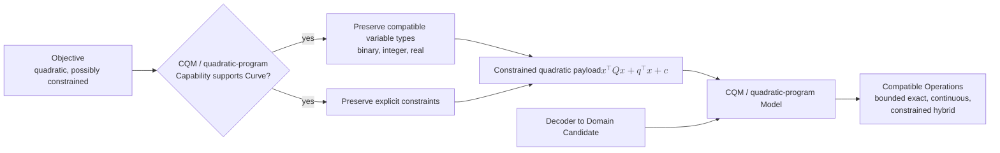

# CQM / quadratic-program formulation

[Back to diagram atlas](../README.md)

## 12. CQM / quadratic-program formulation

A constrained quadratic formulation preserves explicit constraints and supports binary, integer, or real variables where compatible.

$$
\min_x\; x^\top Qx+q^\top x+c
\quad \text{subject to} \quad Ax\le b,\; A_{\mathrm{eq}}x=b_{\mathrm{eq}}.
$$

