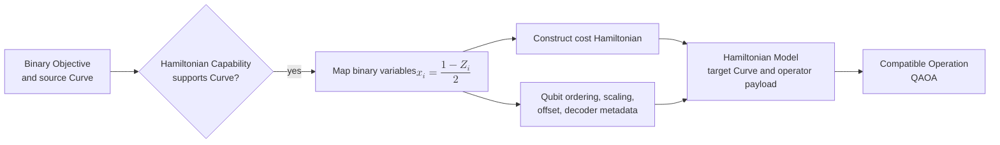

# Hamiltonian / Ising formulation

[Back to diagram atlas](../README.md)

## 13. Hamiltonian / Ising formulation

The formulation maps compatible binary decision semantics into a cost Hamiltonian while preserving the decoder back to a domain candidate.

$$
x_i=\frac{1-Z_i}{2}.
$$

