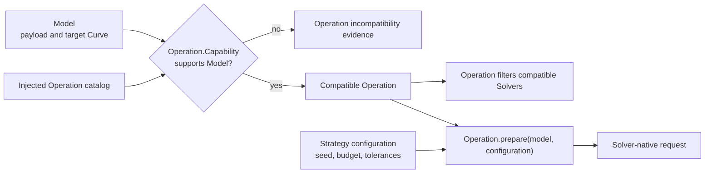

# Operation collaboration

[Back to diagram atlas](../README.md)

## 14. Operation collaboration

An operation checks the model it receives, filters compatible solvers, and prepares a native request without owning backend execution.

