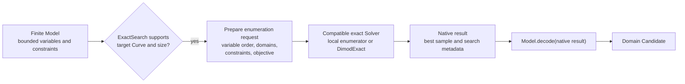

# Exact-search operation

[Back to diagram atlas](../README.md)

## 15. Exact-search operation

Exact search prepares finite enumeration from the model and delegates native execution to a compatible exact solver.

