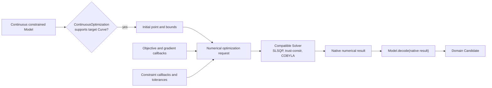

# Continuous-optimization operation

[Back to diagram atlas](../README.md)

## 16. Continuous-optimization operation

Continuous optimization prepares variables, bounds, constraints, objective callbacks, and tolerances for a compatible numerical solver.

