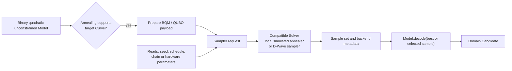

# Annealing operation

[Back to diagram atlas](../README.md)

## 17. Annealing operation

Annealing prepares a binary quadratic model, sampling configuration, and seed or hardware parameters for a compatible sampler.

