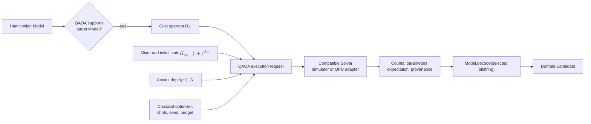

# QAOA operation

[Back to diagram atlas](../README.md)

## 18. QAOA operation

QAOA prepares the cost operator, mixer, ansatz, optimizer, shots, and depth for a compatible gate-model solver.

$$
\lvert\psi(\boldsymbol{\gamma},\boldsymbol{\beta})\rangle=\prod_{\ell=1}^{p} e^{-i\beta_\ell H_M}e^{-i\gamma_\ell H_C}\lvert+\rangle^{\otimes n}.
$$

