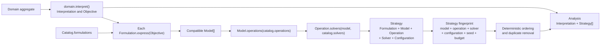

# Capability-driven Strategy construction

[Back to diagram atlas](../README.md)

## 19. Capability-driven Strategy construction

Analysis filters injected catalogs polymorphically and records every compatible formulation–model–operation–solver collaboration as an immutable Strategy.

