```mermaid
flowchart LR
    D["MaxCut aggregate"]
    I["Interpretation"]
    O["Binary quadratic Objective<br/>$$C(x)$$"]
    C["Curve"]
    F1["Direct QUBO"]
    F2["Hamiltonian / Ising"]
    M1["QUBO Model"]
    M2["Hamiltonian Model"]
    OP1["ExactSearch"]
    OP2["Annealing"]
    OP3["QAOA"]
    S1["Exact Solver"]
    S2["Annealing Solver"]
    S3["Gate-model Solver"]
    NR["Native result per Strategy"]
    DECODE["Strategy.model.decode(native result)"]
    CA["MaxCut Candidate"]
    INTERP["max_cut.interpret(candidate)"]
    EV["MaxCut Evaluation"]
    X["Execution record<br/>complete or failed"]
    XS["Execution[]"]
    U["UtilityModel.assess(Execution[])"]
    UT["Utility"]
    P["Policy.apply(Utility)"]
    DEC["Stop | Switch | Scale"]
    R["Recommendation"]
    W["Writer<br/>JSON and artifacts"]

    D --> I --> O --> C
    O --> F1 --> M1
    O --> F2 --> M2
    M1 --> OP1 --> S1 --> NR
    M1 --> OP2 --> S2 --> NR
    M2 --> OP3 --> S3 --> NR
    NR --> DECODE --> CA --> INTERP --> EV --> X --> XS
    S1 -.->|failure captured| X
    S2 -.->|failure captured| X
    S3 -.->|failure captured| X
    XS --> U --> UT --> P --> DEC --> R --> W
```

# Max-Cut reference vertical slice

[Back to diagram atlas](../README.md)

## 20. Max-Cut reference vertical slice

Max-Cut is the first complete migration path used to stabilize object collaboration, compatibility, decoding, evaluation, utility, and recommendation behavior.

$$
C(x)=\sum_{(u,v)\in E} w_{uv}\left(x_u+x_v-2x_u x_v\right).
$$

