```mermaid
flowchart LR
    D["Portfolio aggregate"]
    I["Interpretation"]
    O["Risk–return–cost Objective<br/>$$U(w)$$ with guardrails"]
    C["Source Curve"]

    F1["CQM / quadratic program"]
    F2["Penalty QUBO"]
    F3["Hamiltonian / Ising"]

    M1["Continuous or constrained Model"]
    M2["Binary QUBO Model"]
    M3["Hamiltonian Model"]

    OP1["ContinuousOptimization"]
    OP2["Bounded ExactSearch"]
    OP3["Annealing"]
    OP4["QAOA"]

    S1["Classical numerical Solver"]
    S2["Classical exact Solver"]
    S3["Annealing Solver"]
    S4["Gate-model Solver"]

    NR["Native result per Strategy"]
    DECODE["Strategy.model.decode(native result)"]
    CA["Portfolio Candidate"]
    INTERP["portfolio.interpret(candidate)"]
    EV["Portfolio Evaluation"]
    X["Execution record<br/>quality, feasibility, runtime,<br/>resource cost, provenance"]
    XS["Execution[]"]
    U["Utility comparison"]
    P["Stop | Switch | Scale"]
    R["Recommendation<br/>evidence, explanation, artifacts"]

    D --> I --> O --> C
    O --> F1 --> M1
    O --> F2 --> M2
    O --> F3 --> M3
    M1 --> OP1 --> S1 --> NR
    M1 --> OP2 --> S2 --> NR
    M2 --> OP3 --> S3 --> NR
    M3 --> OP4 --> S4 --> NR
    NR --> DECODE --> CA --> INTERP --> EV --> X --> XS
    S1 -.->|failure captured| X
    S2 -.->|failure captured| X
    S3 -.->|failure captured| X
    S4 -.->|failure captured| X
    XS --> U --> P --> R
```

# Portfolio / Vanguard end-to-end path

[Back to diagram atlas](../README.md)

## 21. Portfolio / Vanguard end-to-end path

The Portfolio path establishes continuous and bounded classical references before QUBO, annealing, Hamiltonian, or QAOA evidence is compared.

$$
U(w)=\mu^\top w-\lambda w^\top\Sigma w-C_{\mathrm{tx}}(w,w^{(0)})-C_{\mathrm{conc}}(w).
$$

