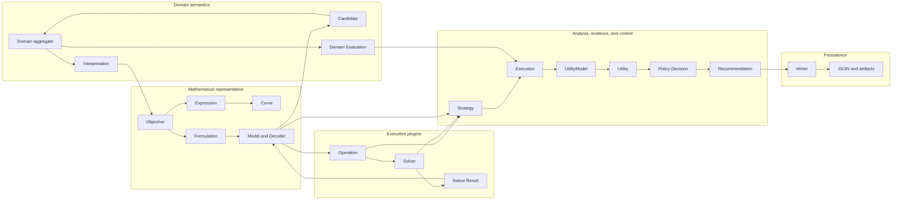

# Object ownership boundaries

[Back to diagram atlas](../README.md)

## 22. Object ownership boundaries

The diagram separates semantic meaning, mathematical representation, execution plugins, comparative evidence, control, and persistence.

