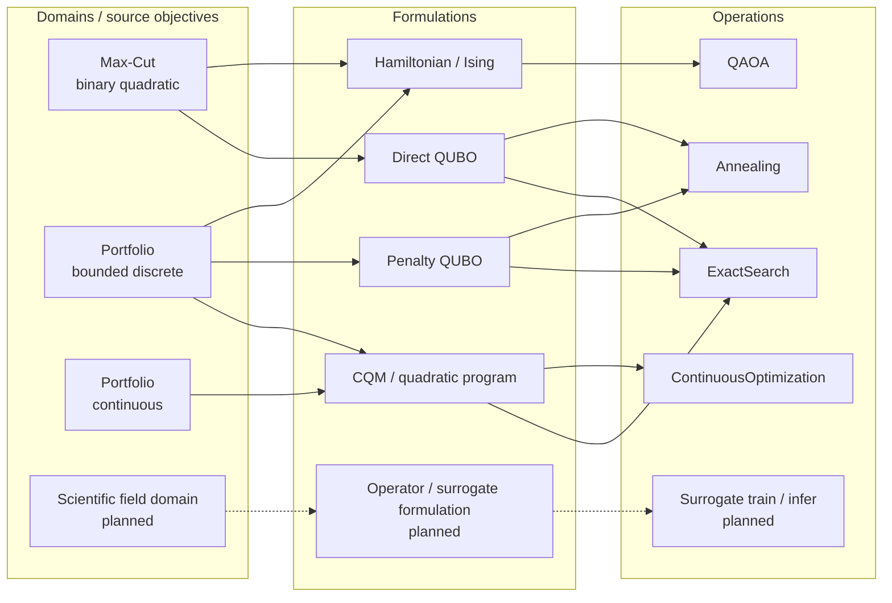

# Domain–Formulation–Operation compatibility lattice

[Back to diagram atlas](../README.md)

## 23. Domain–Formulation–Operation compatibility lattice

The lattice summarizes intended compatibility paths; dashed scientific paths are planned extensions rather than current polynomial implementations.

