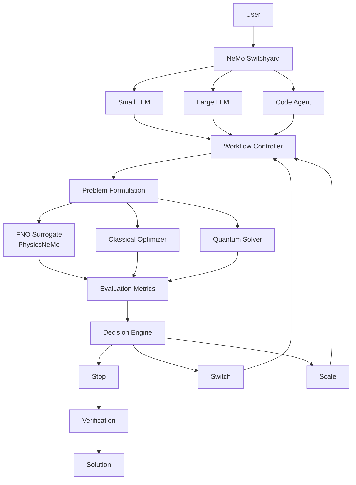

```mermaid
flowchart TD

    A[User] --> B[NeMo Switchyard]

    B --> C1[Small LLM]
    B --> C2[Large LLM]
    B --> C3[Code Agent]

    C1 --> D
    C2 --> D
    C3 --> D

    D[Workflow Controller]

    D --> E[Problem Formulation]

    E --> F[FNO Surrogate<br/>PhysicsNeMo]
    E --> G[Classical Optimizer]
    E --> H[Quantum Solver]

    F --> I[Evaluation Metrics]
    G --> I
    H --> I

    I --> J[Decision Engine]

    J --> K[Stop]
    J --> L[Switch]
    J --> M[Scale]

    L --> D
    M --> D

    K --> N[Verification]
    N --> O[Solution]
```