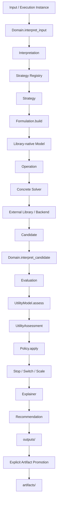
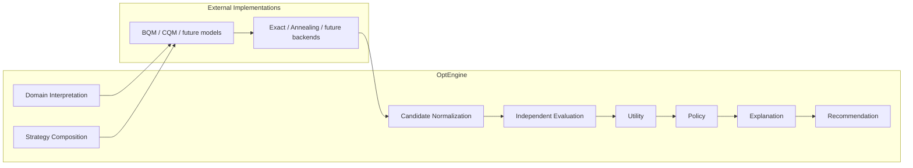

# OptEngine Runtime Architecture

```mermaid
flowchart TD
    I[Input / Execution Instance] --> D[Domain.interpret_input]
    D --> INT[Interpretation]
    INT --> R[Strategy Registry]
    R --> S[Strategy]
    S --> F[Formulation.build]
    F --> M[Library-native Model]
    M --> O[Operation]
    O --> SOL[Concrete Solver]
    SOL --> LIB[External Library / Backend]
    LIB --> C[Candidate]
    C --> DE[Domain.interpret_candidate]
    DE --> E[Evaluation]
    E --> U[UtilityModel.assess]
    U --> UA[UtilityAssessment]
    UA --> P[Policy.apply]
    P --> DEC[Stop / Switch / Scale]
    DEC --> X[Explainer]
    X --> REC[Recommendation]
    REC --> OUT[outputs/]
    OUT --> AR[Explicit Artifact Promotion]
    AR --> CUR[artifacts/]
```

## Ownership boundaries

```mermaid
flowchart LR
    subgraph OptEngine
      DI[Domain Interpretation]
      COMP[Strategy Composition]
      NORM[Candidate Normalization]
      EVAL[Independent Evaluation]
      UTIL[Utility]
      POLICY[Policy]
      EXPLAIN[Explanation]
      REC[Recommendation]
    end
    subgraph External Implementations
      MODEL[BQM / CQM / future models]
      EXEC[Exact / Annealing / future backends]
    end
    DI --> MODEL --> EXEC --> NORM --> EVAL --> UTIL --> POLICY --> EXPLAIN --> REC
    COMP --> MODEL
```
