# OptEngine Mermaid Architecture

> **Mathematical rendering:** Equations use LaTeX. Mermaid flowcharts use `$$...$$`; substantial equations are also stated as Markdown math in the diagram atlas.

> Compact visual companion to [the detailed architecture](./detailed-architecture.md).
>
> The diagrams describe the target object-collaboration architecture. Implementation sequencing is tracked in the [roadmap](./ROADMAP.md).

## 1. End-to-end control flow

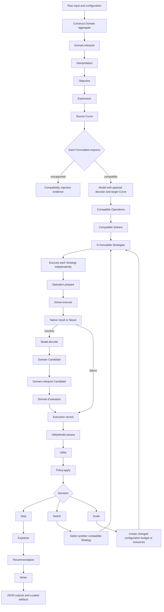

## 2. Object collaboration map

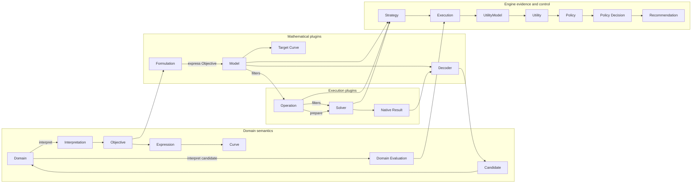

## 3. Core class responsibilities

```mermaid
classDiagram
    class Domain {
        <<abstract>>
        +interpret() Interpretation
        +interpret(candidate) Evaluation
        #_interpret_domain() Interpretation
        #_interpret_candidate(candidate) Evaluation
    }

    class Interpretation {
        +Objective objective
        +metadata
    }

    class Objective {
        +sense
        +Expression expression
        +curve Curve
    }

    class Expression {
        +Variable[] variables
        +LinearTerm[] linear_terms
        +QuadraticTerm[] quadratic_terms
        +Constraint[] constraints
        +constant
        +degree
        +curve Curve
    }

    class Curve {
        +input_types
        +input_count
        +output_types
        +output_count
        +degree
        +constraint_count
        +constraint_degrees
    }

    class Formulation {
        <<abstract>>
        +Capability capability
        +express(Objective) Model
    }

    class Model {
        +Objective objective
        +payload
        +source_curve
        +target_curve
        +decoder
        +metadata
        +fingerprint
        +operations(available)
        +decode(native_result) Candidate
    }

    class Operation {
        <<abstract>>
        +Capability capability
        +solvers(Model, available)
        +prepare(Model, configuration)
    }

    class Solver {
        <<abstract>>
        +Capability capability
        +available
        +execute(request)
    }

    class Strategy {
        +Formulation formulation
        +Model model
        +Operation operation
        +Solver solver
        +configuration
        +seed
        +budget
        +fingerprint
    }

    class Execution {
        +Strategy strategy
        +status
        +native_result
        +candidate
        +evaluation
        +runtime
        +failure
    }

    class UtilityModel {
        <<abstract>>
        +assess(Execution[]) Utility
    }

    class Utility {
        +Execution[] executions
        +scores
        +ranking
        +evidence
        +best
    }

    class Policy {
        <<abstract>>
        +apply(Utility) Decision
    }

    class Recommendation {
        +Domain domain
        +Analysis analysis
        +Execution[] executions
        +Utility utility
        +Decision decision
        +Explanation explanation
    }

    Domain --> Interpretation
    Interpretation --> Objective
    Objective --> Expression
    Expression --> Curve
    Objective --> Formulation
    Formulation --> Model
    Model --> Operation
    Operation --> Solver
    Formulation --> Strategy
    Model --> Strategy
    Operation --> Strategy
    Solver --> Strategy
    Strategy --> Execution
    Execution --> UtilityModel
    UtilityModel --> Utility
    Utility --> Policy
    Policy --> Recommendation
```

## 4. Strategy discovery sequence

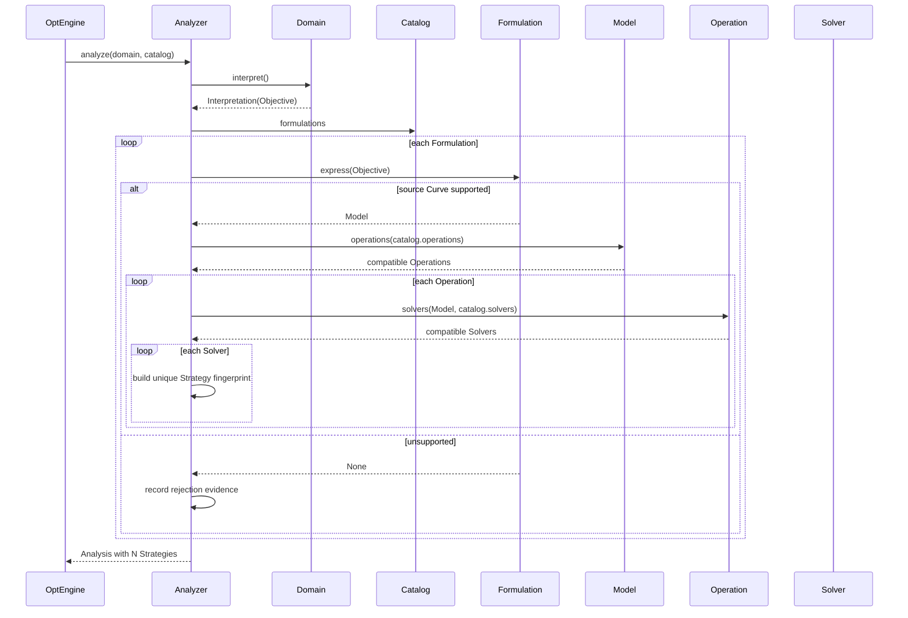

## 5. Failure-isolated execution sequence

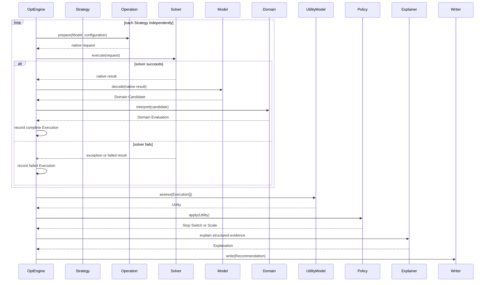

## 6. Domain polymorphism

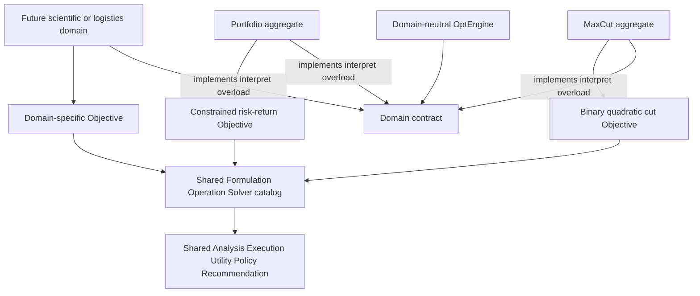

## 7. Max-Cut reference path

```mermaid
flowchart LR
    MC[MaxCut aggregate]
    MCI[MaxCut.interpret]
    OBJ[Maximize Objective]
    EXP[Binary quadratic Expression]
    CURVE[Unconstrained binary quadratic Curve]
    QUBO[QUBO.express]
    MODEL[QUBO Model]

    EXACT[ExactSearch]
    ANNEAL[Annealing]
    DIMOD[DimodExact]
    DWAVE[DWaveLocal]

    SAMPLE[Native sample]
    DECODE[Model.decode]
    CAND[MaxCut Candidate]
    EVAL[MaxCut.interpret Candidate]
    EVIDENCE[Cut value partitions crossing edges feasibility]

    MC --> MCI --> OBJ --> EXP --> CURVE --> QUBO --> MODEL
    MODEL --> EXACT --> DIMOD --> SAMPLE
    MODEL --> ANNEAL --> DWAVE --> SAMPLE
    SAMPLE --> DECODE --> CAND --> EVAL --> EVIDENCE
```

## 8. Portfolio acceptance and Vanguard extension

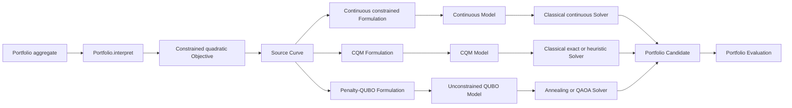

## 9. Stop, Switch, and Scale loops

```mermaid
stateDiagram-v2
    [*] --> Analyze
    Analyze --> Execute: compatible Strategies exist
    Analyze --> ExplainFailure: no compatible Strategy

    Execute --> Assess
    Assess --> Decide

    Decide --> Stop: sufficient utility or terminal condition
    Decide --> Switch: another Strategy is preferable
    Decide --> Scale: more resources remain justified

    Switch --> Execute: select existing Strategy
    Switch --> Analyze: eligibility or formulation changes
    Scale --> Execute: new configuration fingerprint

    Stop --> Explain
    ExplainFailure --> Recommend
    Explain --> Recommend
    Recommend --> Write
    Write --> [*]
```

## 10. Branch-by-abstraction migration

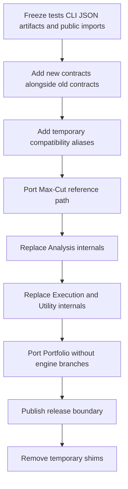

## 11. Logical dependency direction

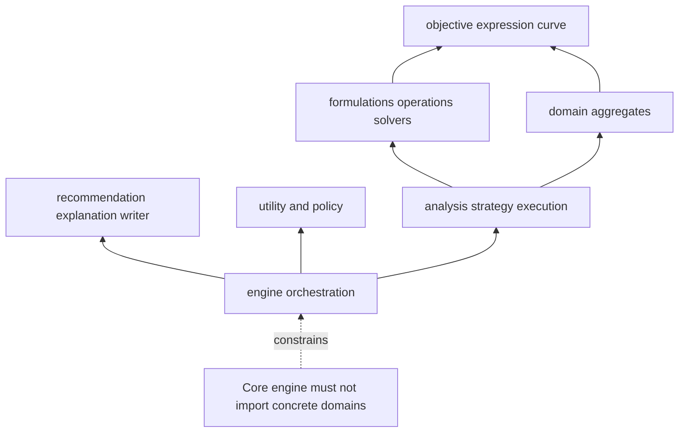

## 12. Interpretation overload contract

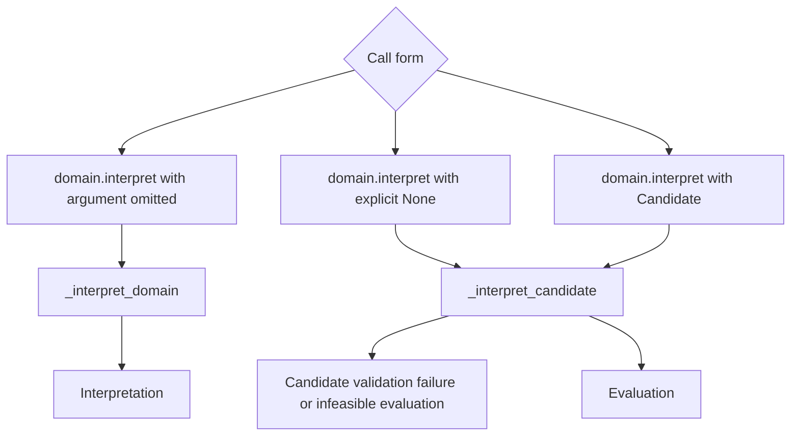

The implementation uses `typing.overload` plus a private sentinel. `None` must never serve as the omission sentinel when the two call forms have different semantics.


## Detailed diagram atlas

See the [Mermaid + LaTeX diagram atlas](./diagrams/README.md).
