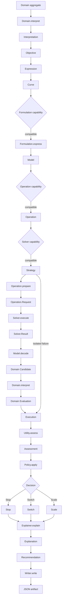

# OptEngine Mermaid Architecture

```mermaid
flowchart TD
    A[Domain aggregate] --> B[Domain.interpret]
    B --> C[Interpretation]
    C --> D[Objective]
    D --> E[Expression]
    E --> F[Curve]

    F --> G{Formulation capability}
    G -->|compatible| H[Formulation.express]
    H --> I[Model]

    I --> J{Operation capability}
    J -->|compatible| K[Operation]
    K --> L{Solver capability}
    L -->|compatible| M[Strategy]

    M --> N[Operation.prepare]
    N --> O[Operation.Request]
    O --> P[Solver.execute]
    P --> Q[Solver.Result]
    Q --> R[Model.decode]
    R --> S[Domain Candidate]
    S --> T[Domain.interpret]
    T --> U[Domain Evaluation]
    U --> V[Execution]

    M -->|isolated failure| V
    V --> W[Utility.assess]
    W --> X[Assessment]
    X --> Y[Policy.apply]
    Y --> Z{Decision}

    Z -->|Stop| AA[Stop]
    Z -->|Switch| AB[Switch]
    Z -->|Scale| AC[Scale]

    AA --> AD[Explainer.explain]
    AB --> AD
    AC --> AD
    AD --> AE[Explanation]
    AE --> AF[Recommendation]
    AF --> AG[Writer.write]
    AG --> AH[JSON artifact]
```

Every compatibility edge is based on object properties and `Curve`, not a
Domain or objective-type switch.
