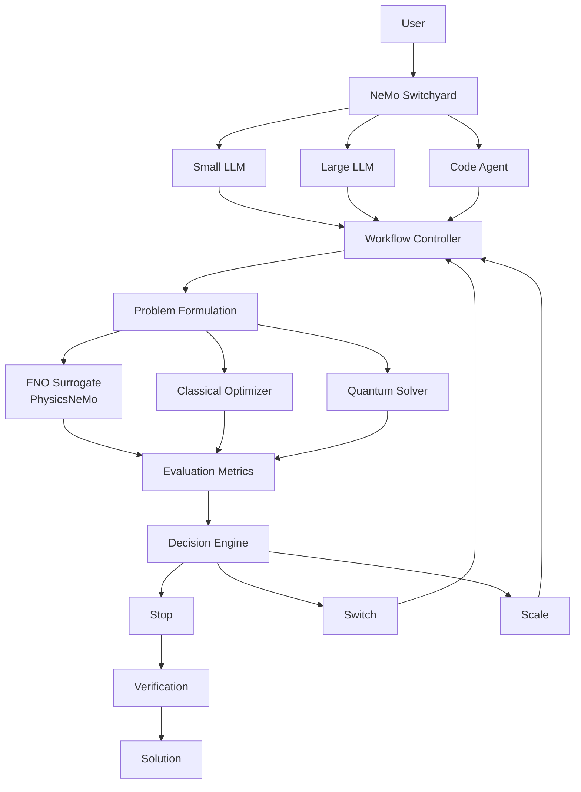

# OptEngine Architecture — Mermaid View

This document provides the compact control-flow representation of the same
platform architecture shown in the
[detailed architecture](detailed-architecture.md).

## Architectural Role

This Mermaid view emphasizes the platform’s control flow and decision loop.

The detailed ASCII view expands the same architecture with example providers,
solver technologies, evaluated metrics, and decision semantics.

## Current Implementation Status

The `v0.1.x` platform foundation implements the execution lifecycle, software
contracts, package boundaries, deterministic demonstration stages, output and
artifact handling, tests, CI, packaging, and release automation.

Named external model-routing, PhysicsNeMo, classical-optimization, and
quantum-optimization integrations remain planned functional implementations.