# OptEngine Mature Object-Collaboration — Mermaid Source

[Back to package index](./README.md)

These diagrams are editable Mermaid companions to the full rendered diagram set in [`DIAGRAMS.md`](./DIAGRAMS.md).

## 1. Generic domain overload and interpretation behavior

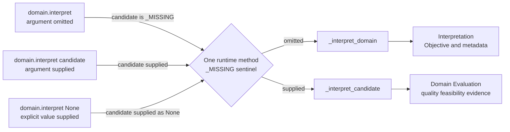

## 2. Max-Cut aggregate self-interpretation

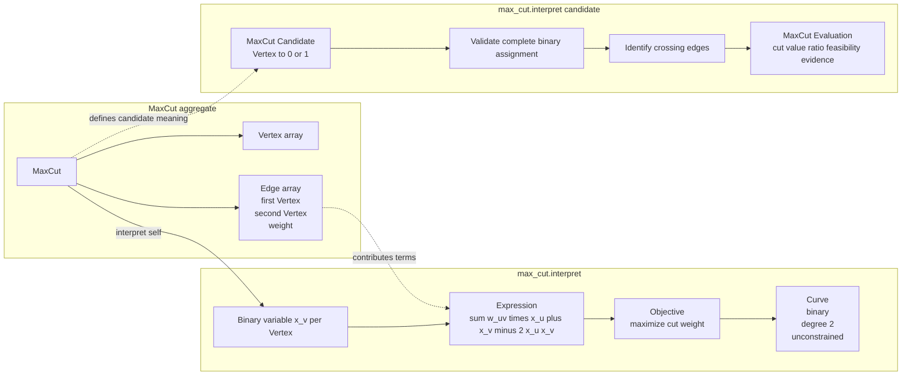

## 3. Portfolio aggregate self-interpretation

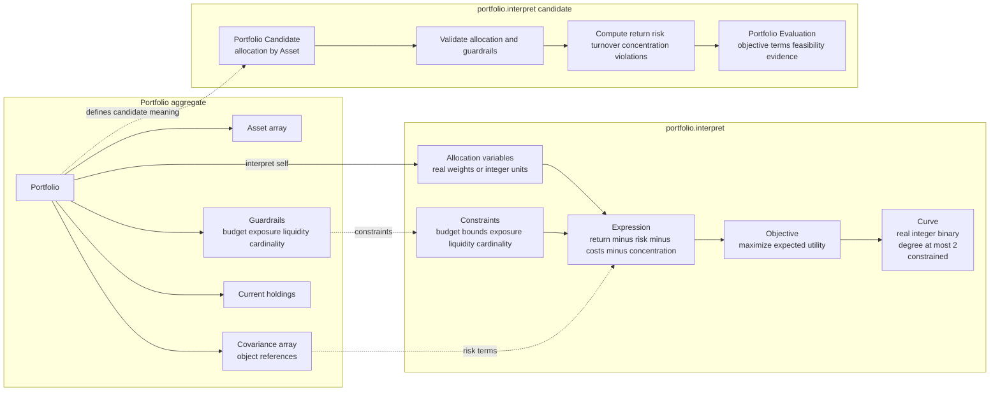

## 4. Objective, Expression, and Curve

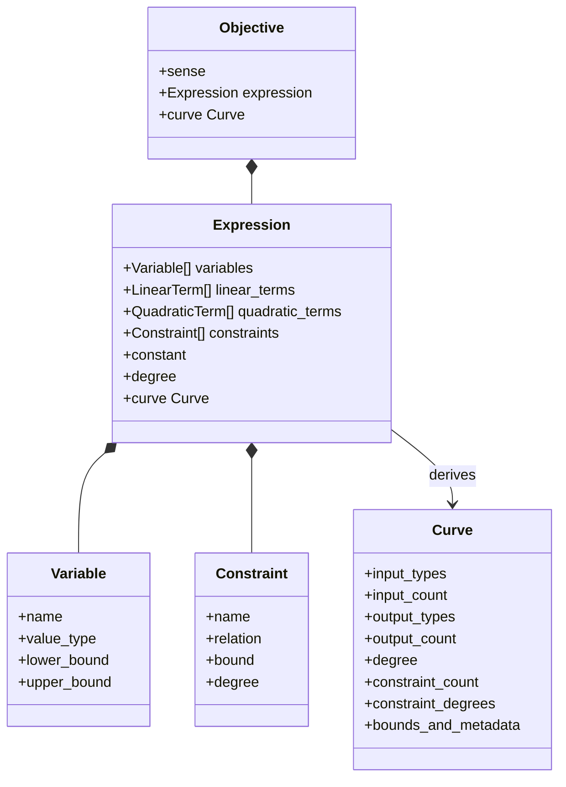

## 5. Formulation collaboration

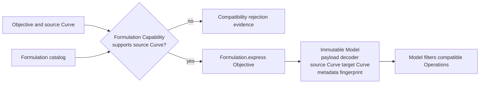

## 6. Formulation families

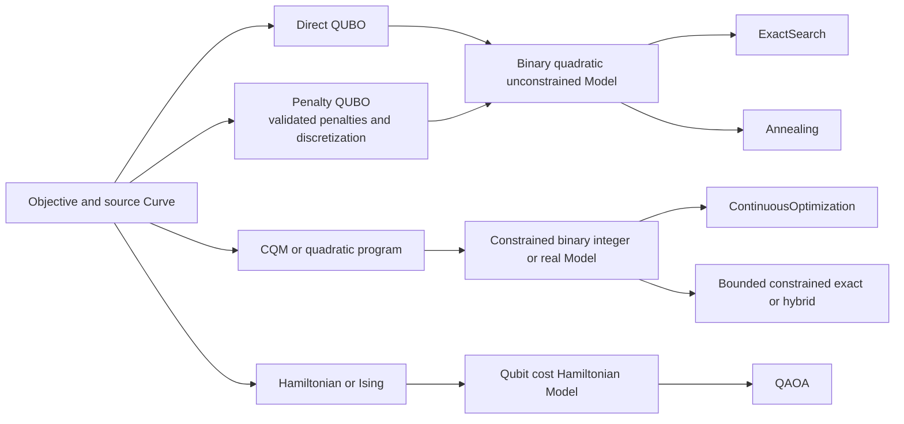

## 7. Operation collaboration

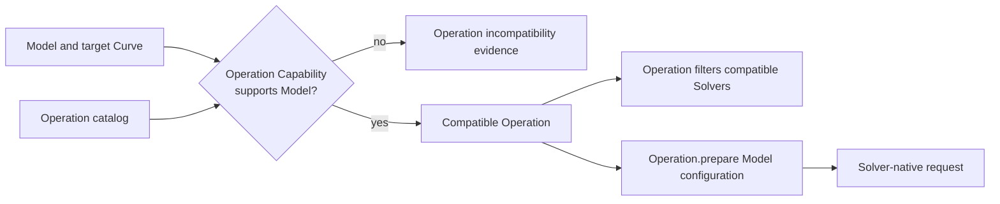

## 8. Capability-driven Strategy construction

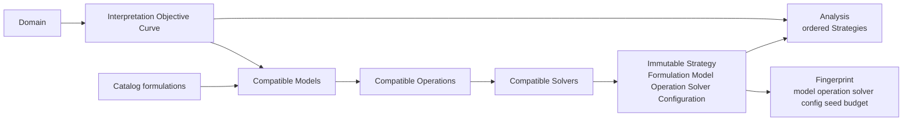

## 9. Max-Cut reference path

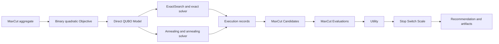

## 10. Portfolio and Vanguard path

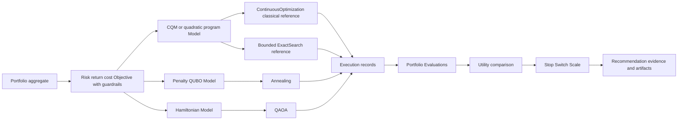

## 11. Ownership boundaries

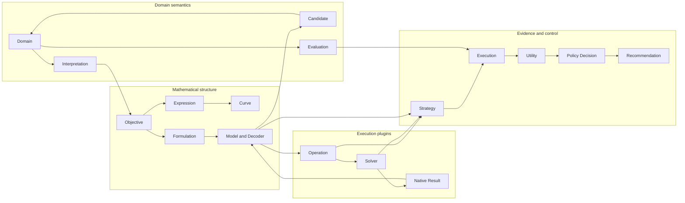

## 12. Compatibility lattice

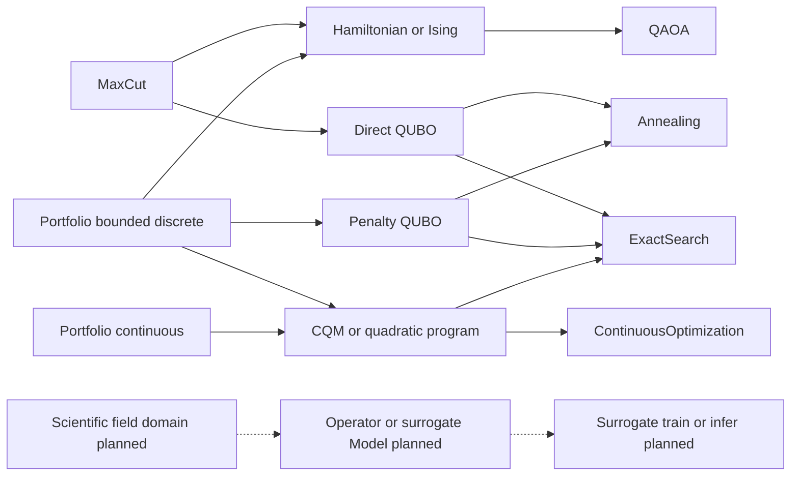
